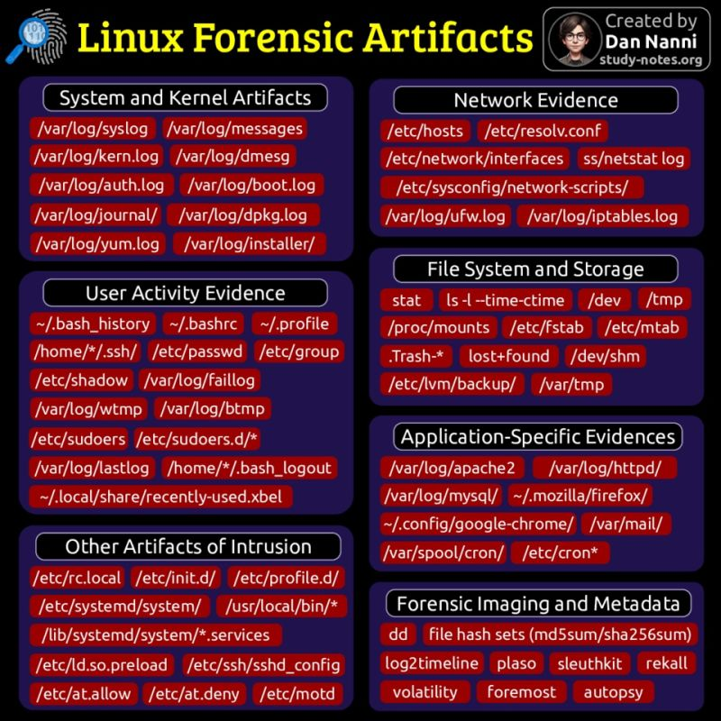

[NomadicGopher's HackTheBox Profile Page](https://app.hackthebox.com/users/2141921)

<!--
    * To connect to HTB, use `sudo openvpn {filename.ovpn}`
    * The key-phrase worknotes can be found in a lab to hint next target for exploitation.
-->

## Notes

* [Conceptual](./Conceptual.md)
* [Tools](./Tools.md)
* [Vocab & Frameworks](./Vocab_&_Frameworks.md)

## Resources

* [OWASP Top Ten](https://owasp.org/www-project-top-ten): The OWASP Top 10 is a standard awareness document for developers and web application security. It represents a broad consensus about the most critical security risks to web applications.
* [PTES - Penetration Testing Execution Standards](http://www.pentest-standard.org/index.php/Main_Page)
  1. **Pre Engagement Interactions**: Preparation documentation & determining tools
  2. **Intelligence Gathering**: Gain info from external sources like google and social profiles (aka OSINT - Open Source Intelligence)
  3. **Threat Modeling**: Typically skipped
  4. **Vulnerability Anaysis**: Active engagement to gather info
  5. **Exploitation**: Active engagement to break target with identified vulnerabilities
  6. **Post Exploitation**: Attet to keep control of the system for investigaton or exploitation later 
  7. **Reporting**: Articulate findings to client in an unerstandable manner

## Tools

* [Starred Cybersecurity Resources](https://github.com/stars/nomadicGopher/lists/cybersecurity-resources)
* Research
  * [Process Explorer](https://learn.microsoft.com/en-us/sysinternals/downloads/process-explorer) 
* Reverse Engineering
  * [IDA - Interactive DisAssembler (by hex-rays)](https://hex-rays.com/ida-free)
  * [Binary Ninja](https://binary.ninja/)
* SAST (Static Application Security Testing)
  * [CodeQL (by GitHub](https://codeql.github.com/)
  * [SonarQube (by SonarSource)](https://www.sonarsource.com/products/sonarqube/downloads/)
* DAST (Dynamic Application Security Testing)
  * [ZAP (by OWASP)](https://www.zaproxy.org/download/)
  * Burp Suite Community Edition
    * Learn via [Web Security Academy (by Portswigger)](https://portswigger.net/web-security)
* IAST (Interactive Application Security Testing)
  * `TODO: Consider building a lightweight tool that builds a report as the exe runs.`
* Misc
  * [Valgrind (memory leaks)](https://valgrind.org/help/projects.html)

## Vulnerable Applications

* [Juice Shop](https://owasp.org/www-project-juice-shop/)
* [CICD Goat](https://github.com/cider-security-research/cicd-goat)
* [crackmes.one](https://crackmes.one/crackme/684dab612b84be7ea77438a7) [(Reverse Engineering)](https://medium.com/@cy1337/reversing-a-simple-crackme-with-ghidra-decompiler-5dd1b1c3c0ba)

## Capture The Flag

* [Awesome CTF](https://github.com/apsdehal/awesome-ctf)
* [CTF 101](https://ctf101.org/)

## Legal Practice

## Linux Forensic Artifacts

